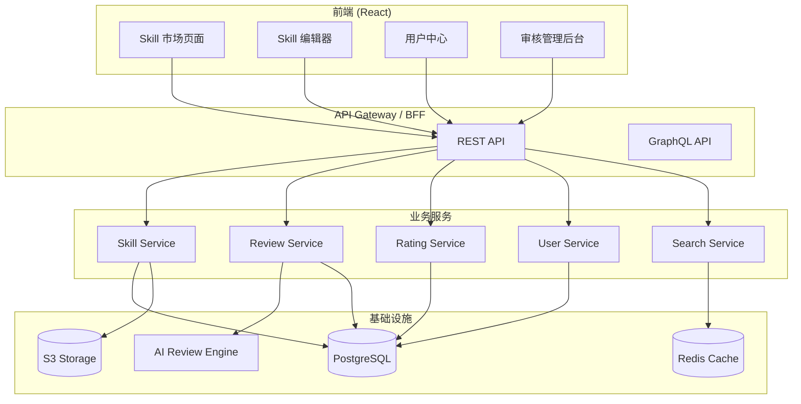
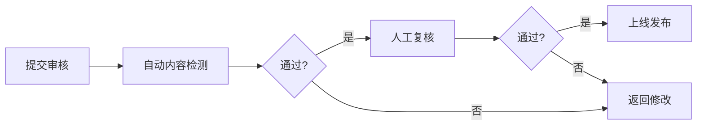
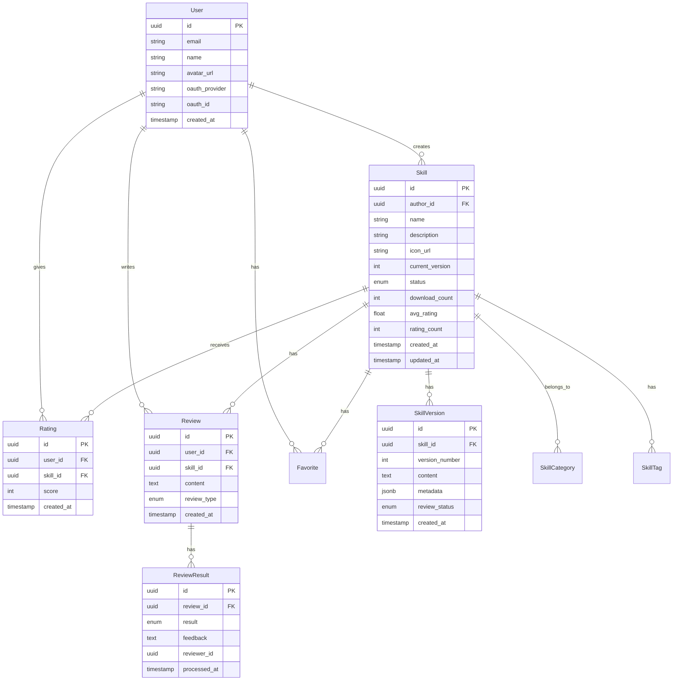
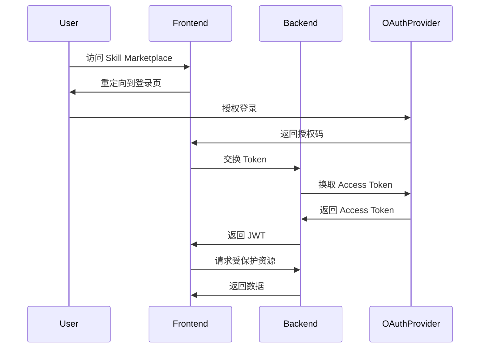
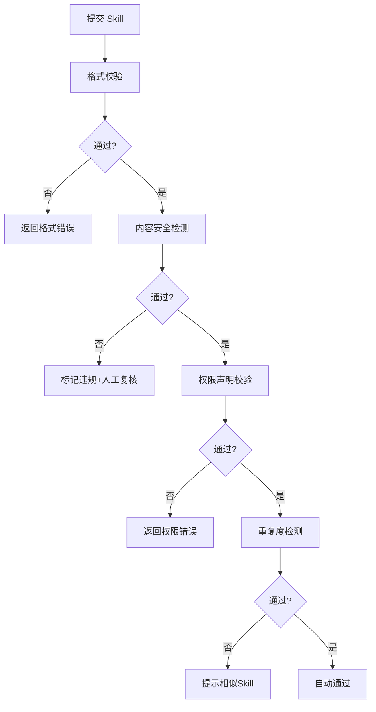
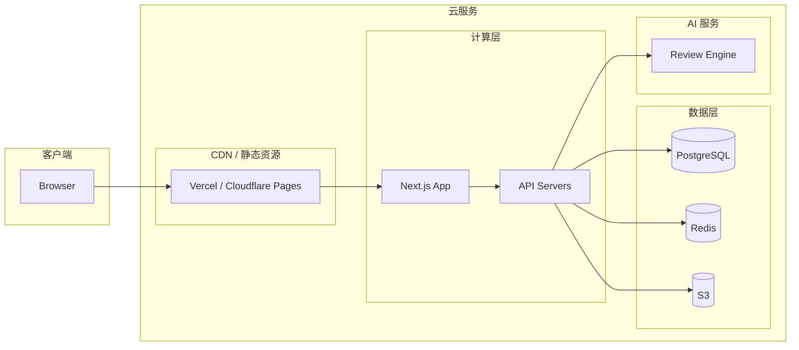

# Skill Marketplace 技术设计方案

需求名称：skill-marketplace
更新日期：2026-04-13

## 1. 概述

Skill Marketplace 是一个供用户发现、在线创建、审核和评价 AI Skills 的全栈平台系统。

## 2. 技术栈

| 层级 | 技术选型 |
|------|----------|
| 前端框架 | React 18 + TypeScript |
| 后端框架 | Node.js + Express (或 Next.js API Routes) |
| 数据库 | PostgreSQL |
| 认证方案 | OAuth 2.0 (支持 GitHub/Google 登录) |
| 文件存储 | S3 兼容对象存储 |
| 部署模式 | 全栈 (前端 + BFF + 后端服务) |

## 3. 系统架构



## 4. 功能模块

### 4.1 Skill 发现 (Discovery)

| 功能 | 描述 |
|------|------|
| 搜索 | 全文检索 (标题、描述、标签) |
| 分类浏览 | 按类别、功能标签筛选 |
| 排行榜 | 下载量、评分、热度排序 |
| 个性化推荐 | 基于用户历史的智能推荐 |
| 预览 | 在线预览 Skill 内容 |

**API 端点**:
- `GET /api/skills` - 列表/搜索
- `GET /api/skills/:id` - 详情
- `GET /api/skills/:id/preview` - 预览内容
- `GET /api/skills/featured` - 推荐技能

### 4.2 在线创建 (Creation)

| 功能 | 描述 |
|------|------|
| SKILL.md 编辑器 | Markdown 编辑器 + 实时预览 |
| 元数据编辑 | 名称、描述、分类、标签、图标 |
| 版本管理 | 多版本发布与历史回滚 |
| 草稿保存 | 自动保存草稿 |
| 依赖声明 | 声明所需工具权限 |

**API 端点**:
- `POST /api/skills` - 创建 Skill
- `PUT /api/skills/:id` - 更新 Skill
- `POST /api/skills/:id/versions` - 发布新版本
- `GET /api/skills/:id/versions` - 版本历史

### 4.3 审核流程 (Review)

采用**自动审核为主 + 人工复核为辅**的策略：



**自动审核规则**:
- 内容安全检测 (敏感词、恶意代码)
- 格式校验 (SKILL.md 结构完整性)
- 重复检测 (与现有 Skill 的相似度)
- 权限声明校验 (allowed-tools 合法性)

**API 端点**:
- `POST /api/skills/:id/submit-review` - 提交审核
- `GET /api/skills/:id/review-status` - 审核状态
- `POST /api/reviews/:id/approve` - 人工通过
- `POST /api/reviews/:id/reject` - 人工拒绝

### 4.4 评价系统 (Rating)

| 功能 | 描述 |
|------|------|
| 评分 | 1-5 星评分 |
| 评论 | 文字评价与回复 |
| 收藏 | 收藏 Skill |
| 举报 | 举报违规 Skill |
| 下载统计 | 下载量追踪 |

**API 端点**:
- `POST /api/skills/:id/ratings` - 评分
- `GET /api/skills/:id/ratings` - 评分列表
- `POST /api/skills/:id/reviews` - 评论
- `POST /api/skills/:id/favorite` - 收藏
- `POST /api/skills/:id/report` - 举报

## 5. 数据模型

### 5.1 核心实体



### 5.2 枚举类型

```typescript
enum SkillStatus {
  DRAFT = 'draft',           // 草稿
  PENDING_REVIEW = 'pending_review',  // 待审核
  APPROVED = 'approved',     // 已通过
  REJECTED = 'rejected',     // 已拒绝
  BANNED = 'banned'           // 被封禁
}

enum ReviewStatus {
  PENDING = 'pending',       // 待审核
  AUTO_CHECKING = 'auto_checking',  // 自动检测中
  MANUAL_REVIEW = 'manual_review',   // 人工复核
  APPROVED = 'approved',    // 通过
  REJECTED = 'rejected'     // 拒绝
}

enum ReviewResultType {
  AUTO_PASS = 'auto_pass',   // 自动通过
  AUTO_FAIL = 'auto_fail',  // 自动拒绝
  MANUAL_APPROVE = 'manual_approve',  // 人工通过
  MANUAL_REJECT = 'manual_reject'     // 人工拒绝
}
```

## 6. SKILL.md 标准格式

平台采用统一的 SKILL.md 格式：

```markdown
---
name: skill-name
description: One-line description
allowed-tools:
  - Bash(*)
  - Read(*)
  - Edit(*)
when_to_use: |
  When the user wants to...
argument-hint: "[optional description]"
arguments:
  - param1
  - param2
context: inline
tags:
  - code-review
  - react
category: development
version: 1.0.0
author:
  name: Author Name
  email: author@example.com
---

# Skill Title

Description of skill

## Inputs
- `$param1`: Description

## Goal
Clearly stated goal

## Steps

### 1. Step Name
What to do

**Success criteria**: How to verify
```

## 7. 认证方案 (OAuth 2.0)



**支持的 OAuth 提供商**:
- GitHub
- Google

## 8. 自动审核引擎

### 8.1 审核流程



### 8.2 检测规则

| 检测项 | 实现方式 |
|--------|----------|
| 格式校验 | JSON Schema 验证 SKILL.md frontmatter |
| 内容安全 | 敏感词库 + AI 内容分类 |
| 恶意代码 | 静态分析 + 沙箱执行 |
| 权限声明 | 权限白名单校验 |
| 重复检测 | 向量相似度 (embedding) |

## 9. 项目结构

```
skill-marketplace/
├── frontend/                    # React 前端
│   ├── src/
│   │   ├── components/         # 公共组件
│   │   ├── pages/              # 页面组件
│   │   │   ├── marketplace/   # 市场发现页
│   │   │   ├── editor/        # Skill 编辑器
│   │   │   ├── skill/          # Skill 详情页
│   │   │   └── admin/          # 审核管理后台
│   │   ├── services/           # API 调用
│   │   ├── hooks/              # 自定义 Hooks
│   │   ├── context/            # React Context
│   │   └── utils/              # 工具函数
│   └── package.json
│
├── backend/                    # Node.js 后端
│   ├── src/
│   │   ├── controllers/         # 控制器
│   │   ├── services/            # 业务逻辑
│   │   ├── models/              # 数据模型
│   │   ├── middleware/          # 中间件
│   │   ├── routes/              # 路由定义
│   │   ├── utils/               # 工具函数
│   │   └── config/              # 配置文件
│   └── package.json
│
├── review-engine/              # 自动审核引擎
│   ├── src/
│   │   ├── detectors/          # 检测器
│   │   │   ├── format.ts        # 格式校验
│   │   │   ├── content.ts       # 内容安全
│   │   │   ├── permission.ts    # 权限校验
│   │   │   └── duplicate.ts     # 重复检测
│   │   └── index.ts
│   └── package.json
│
└── docker-compose.yml           # 本地开发环境
```

## 10. 部署架构



## 11. 正确性属性

### 11.1 功能正确性
- 所有 API 响应符合 OpenAPI 规范
- 数据一致性：事务保证跨表操作原子性
- 幂等性：重复提交不会产生副作用

### 11.2 安全性
- OAuth 2.0 + JWT Token 认证
- RBAC 权限控制 (作者/审核员/管理员)
- 输入验证与 SQL 注入防护
- XSS 防护

### 11.3 可用性
- 服务健康检查
- 审核队列监控
- 降级策略 (审核失败不阻塞发布)

## 12. 错误处理

| 错误类型 | HTTP 状态码 | 处理策略 |
|----------|-------------|----------|
| 参数错误 | 400 | 返回具体字段错误信息 |
| 未授权 | 401 | 跳转登录页 |
| 权限不足 | 403 | 提示权限不足 |
| 资源不存在 | 404 | 提示资源未找到 |
| 审核未通过 | 422 | 返回审核反馈 |
| 服务器错误 | 500 | 记录日志，返回通用错误 |

## 13. 测试策略

| 测试类型 | 工具 | 覆盖率目标 |
|----------|------|------------|
| 单元测试 | Jest / Vitest | 80%+ |
| 集成测试 | Supertest | 核心流程全覆盖 |
| E2E 测试 | Playwright | 用户关键路径 |
| 审核引擎测试 | Jest | 各检测器 90%+ |

## 14. 实施计划

### Phase 1: 基础功能 (MVP)
- [ ] 用户认证 (OAuth)
- [ ] Skill CRUD
- [ ] 基础搜索与浏览

### Phase 2: 审核系统
- [ ] 审核流程
- [ ] 自动内容检测
- [ ] 审核管理后台

### Phase 3: 评价系统
- [ ] 评分与评论
- [ ] 收藏与举报
- [ ] 排行榜

### Phase 4: 高级功能
- [ ] 个性化推荐
- [ ] Skill 版本管理
- [ ] 社区互动

## 15. 外部依赖

| 依赖 | 用途 |
|------|------|
| PostgreSQL | 主数据库 |
| Redis | 缓存、Session |
| S3 | Skill 文件存储 |
| AI Model API | 内容安全检测 |

## 16. 参考链接

[^1]: [SKILL.md Format](./src/skills/bundledSkills.ts)
[^2]: [OAuth 2.0 RFC6749](https://datatracker.ietf.org/doc/html/rfc6749)
